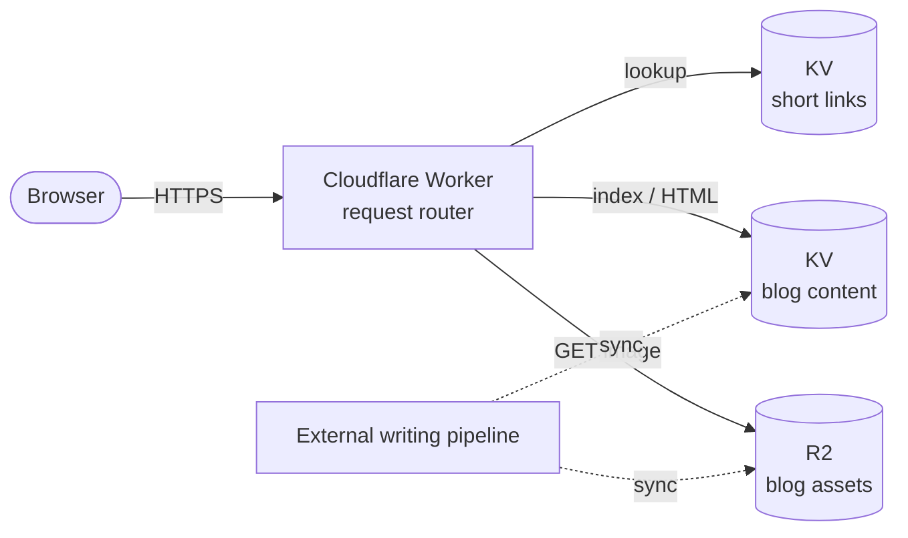

# 02 — Architecture

## At a glance

## Component responsibilities

| Component | Role (public side) |
|-----------|--------------------|
| **Cloudflare Worker** | Single request entry point. Routes by path to: static SEO files, home / about / works, blog, short-code redirects. |
| **KV — short links** | `code → target URL` mapping. A request to `/<code>` looks this up and returns a 302. |
| **KV — blog content** | Article index (e.g. `articles.json`) plus pre-rendered article HTML. Read directly at request time — no markdown parsing in the hot path. |
| **R2** | Image assets used in blog posts. Served via the Worker or directly from R2's public URL, depending on route config. |
| **External writing pipeline** | Out of scope for this repo. Produces markdown + images, which sync scripts push into KV / R2. See [04 — Blog pipeline](./04-blog-pipeline.en.md). |

## Why this shape

- **Worker as the single entry point**: no servers to run; fast cold start; CDN built in.
- **Dynamic data in KV**: write-rarely / read-often fits KV's eventual-consistency + edge-read model. Both short-link redirects and article content match this pattern.
- **Large blobs in R2**: images don't fit well in KV (size limits, cost profile). R2 is S3-compatible object storage with zero egress fees.
- **Pre-render HTML, store in KV**: avoid running a markdown parser inside the Worker. Request time becomes pure string reads — very low latency.

## Not on this diagram

- The admin area: a separate, authenticated path. Not covered in this repo.
- Stats / click tracking: lives behind admin.
- Cloudflare config (namespace IDs, bindings, custom domain): deployment detail, kept in the private repo.

## Public route list

See [03 — Public routes](./03-routing.en.md).
