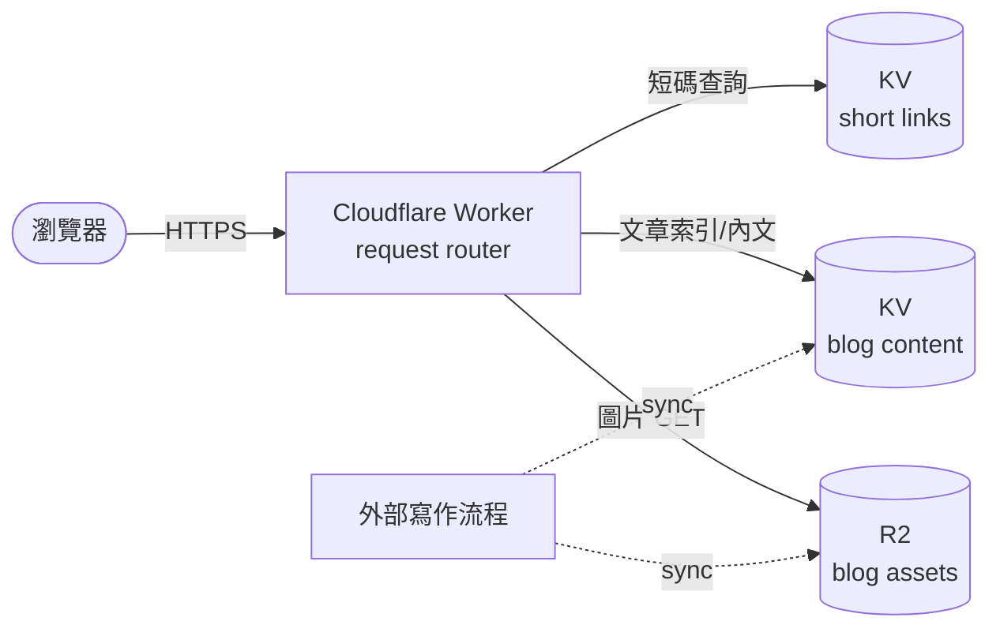

# 02 — 架構

## 一張圖

## 元件職責

| 元件 | 職責（公開部分） |
|------|------------------|
| **Cloudflare Worker** | 唯一的請求進入點。判斷 path 後分流到：靜態 SEO 檔案、首頁 / about / works、Blog、短碼跳轉。 |
| **KV — short links** | 短碼 → 目標 URL 的對應表。Worker 收到 `/<code>` 就查這個 KV，做 302 跳轉。 |
| **KV — blog content** | 文章索引（`articles.json` 之類）+ 已渲染好的文章 HTML。Worker 直接讀，不在 request time 做 markdown 渲染。 |
| **R2** | Blog 內文用到的圖片資產。瀏覽器走 Worker 代理或直接走 R2 public URL（依路由設定）。 |
| **外部寫作流程** | 不在這個 repo 範圍。產出 markdown + 圖片 → 由同步腳本灌進 KV / R2。詳見 [04 — Blog pipeline](./04-blog-pipeline.zh.md)。 |

## 為什麼是這個組合

- **Worker 當唯一進入點**：不用維運伺服器；冷啟動快；自帶 CDN。
- **動態資料放 KV**：寫少讀多，KV 的「最終一致 + 全球邊緣讀取」剛好。短網址跳轉、文章內容都符合這個 pattern。
- **大檔案放 R2**：圖片不適合放 KV（KV value 大小有上限，且 KV 計費對大物件不利）。R2 是 S3-相容物件儲存，零 egress 費。
- **HTML 預先渲染、塞進 KV**：避免在 Worker 內跑 markdown parser，request time 只做字串讀取，延遲低。

## 不在這張圖上的東西

- 後台（admin）：另一條獨立路徑，需要登入；本 repo 不介紹。
- Stats / 點擊統計：屬於後台。
- Cloudflare 設定（namespace ID、bindings、custom domain）：屬於部署細節，留在私有 repo。

## 公開路由清單

詳見 [03 — Public routes](./03-routing.zh.md)。
