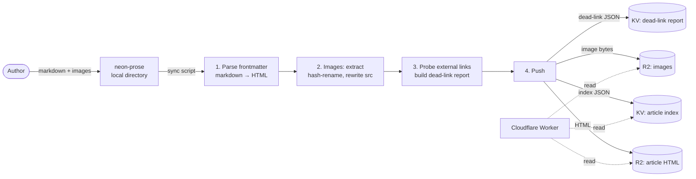

# 04 — Blog content pipeline

## Why a pipeline at all

Blog content is **not** written into the Worker, and **not** rendered from markdown at request time.
Reasons:

- The Worker should stay fast — markdown parsing and image work don't belong on the hot path.
- An offline writing tool offers more capability and a better authoring experience than typing into an admin form.
- Markdown lives in a separate pipeline (an external writing tool, `neon-prose`), so a clear "sync" boundary is needed.

So the design is a one-way flow: **write → build → sync to KV/R2 → Worker reads**.

## At a glance



## Step by step

### 1. Parse frontmatter + markdown
- Read each markdown file; pull frontmatter (title, collection, slug, published date, tags, etc.).
- Convert markdown → HTML (content block only, no layout chrome).

### 2. Image handling
- Extract every `` from the rendered HTML.
- Rename each image with a content hash (e.g. `abc12345.jpg`) to make caching trivial.
- Rewrite the `src` attributes in the HTML to point at hashed names.
- Upload the image bytes to the R2 image bucket.

### 3. External link probing
- Run `HEAD` / `GET` checks on links to vocus (an external blogging platform).
- Produce a "dead / unchecked" report that the admin area can display.

### 4. Push (a single sync command)
- HTML → R2 article bucket, key shape `articles/<collection>/<slug>.html`.
- Images → R2 image bucket.
- Index JSON → KV at `articles:index`, shape `[{ collection, slug, title, published_at, ... }, ...]`.
- Dead-link report JSON → KV at `articles:dead-report`.

`--dry-run` is supported: prints what would happen without pushing anything.

## How the Worker reads

- `/blog`: reads the KV `articles:index` and renders the list.
- `/blog/<collection>/<slug>`: looks up the article in the index, fetches `articles/<collection>/<slug>.html` from R2, wraps it in the layout template, returns it.
- `/sitemap.xml`: builds dynamically from the same index.

```
KV index = "directory" — tells the Worker which articles exist, with metadata.
R2 HTML  = "content"   — fetched on demand.
```

## Why split it this way

- **Pre-rendered HTML**: the Worker never touches a markdown parser — request time is just a string read from R2.
- **Index in KV, body in R2**: the index is read on every list page, so it has to be small and fast (KV fits). Each article body is tens of KB and many in count — R2 is cheaper for that profile.
- **Hash-named images**: aggressive caching for free, with natural cache-busting whenever content changes.
- **Dead-link probing rolled into sync**: catches link rot during the writing flow, no separate cron needed.

## What this repo doesn't include

- The full sync script (lives in the private repo).
- Bucket / namespace names and binding configuration.
- vocus probing details (rate limits, retries).
- The `neon-prose` writing tool itself.
