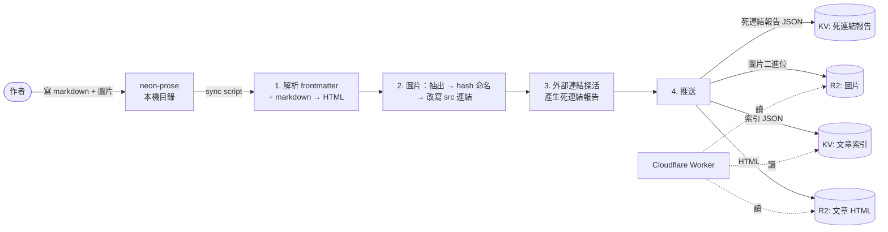

# 04 — Blog 內容流程

## 為什麼要有 pipeline

Blog 內容**不是**直接寫進 Worker，也**不是**在 request time 從 markdown 渲染 HTML。
理由：

- Worker 要快，不適合在 request time 做 markdown parser + 圖片處理
- 寫作工具（離線、本機）的功能與儀式感 ≫ 直接寫在後台
- Markdown 來源是另一個獨立流程（外部寫作工具 `neon-prose`），需要一個明確的「同步」邊界

所以採取：**寫作 → build → sync 到 KV/R2 → Worker 讀**的單向流。

## 一張圖



## 各步驟在做什麼

### 1. 解析 frontmatter + markdown
- 讀 markdown 檔，抓 frontmatter（標題、collection、slug、發佈日、tags 等）
- markdown → HTML（純內容區塊，不含 layout chrome）

### 2. 圖片處理
- 從 HTML 抽出所有 ``
- 用內容 hash 重新命名（例如 `abc12345.jpg`），避免快取問題
- 改寫 markdown / HTML 內的 src 指到 hash 後的檔名
- 上傳圖片二進位到 R2 圖片 bucket

### 3. 外部連結探活
- 跑 vocus（外部部落格平台）連結的 `HEAD` / `GET` 探測
- 產生「死連結 / 待查連結」報告，後台可顯示

### 4. 推送（單一 sync 命令）
- HTML → R2 文章 bucket，key 形如 `articles/<collection>/<slug>.html`
- 圖片 → R2 圖片 bucket
- 索引 JSON → KV，key `articles:index`，內容是 `[{ collection, slug, title, published_at, ... }, ...]`
- 死連結報告 JSON → KV，key `articles:dead-report`

支援 `--dry-run`：只輸出會做什麼、不真的推上去。

## Worker 端怎麼讀

- `/blog`：讀 KV 的 `articles:index`，渲染列表
- `/blog/<collection>/<slug>`：先在索引找 article 物件，再從 R2 拉對應 `articles/<collection>/<slug>.html`，套進 layout 模板回傳
- `/sitemap.xml`：用同一份索引動態生成

```
KV index = "目錄"，告訴 Worker 有哪些文章、metadata 是什麼
R2 HTML = "內容"，按需讀取
```

## 為什麼這樣分層

- **HTML 預先渲染**：Worker 完全不碰 markdown parser，request time 是純 R2 讀取
- **索引放 KV、內文放 R2**：索引需要每個列表頁都讀，要快、要小，KV 適合；內文一篇可能十幾 KB，數量多，R2 比 KV 划算
- **內容 hash 命名圖片**：可以開超長 cache，又能在內容更新時自然 cache-bust
- **死連結探活和 sync 一起做**：寫作流程裡順便檢查，不用另外跑 cron

## 這個 repo 不附的東西

- 同步腳本完整實作（在私有 repo）
- bucket / namespace 名稱與 binding 設定
- vocus 探活的 rate limit / 重試細節
- neon-prose 寫作工具本身
